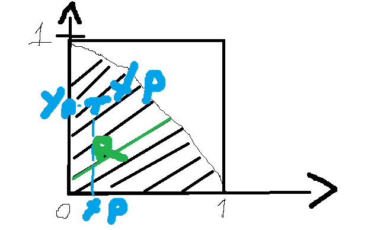
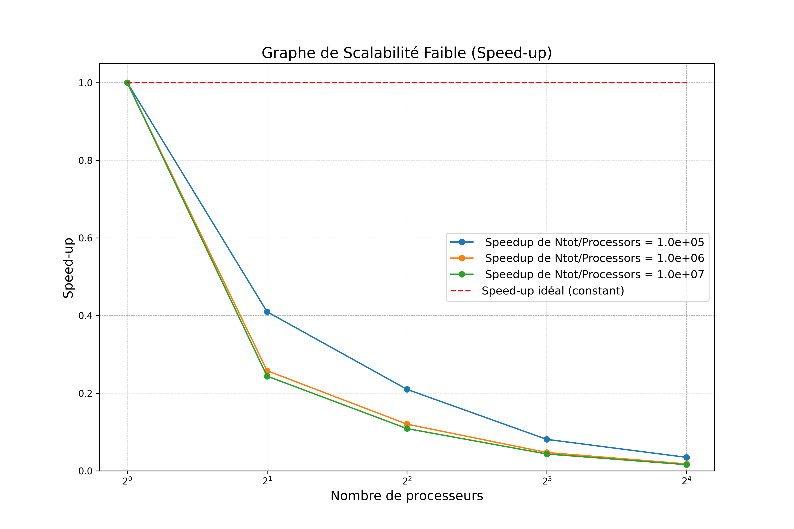
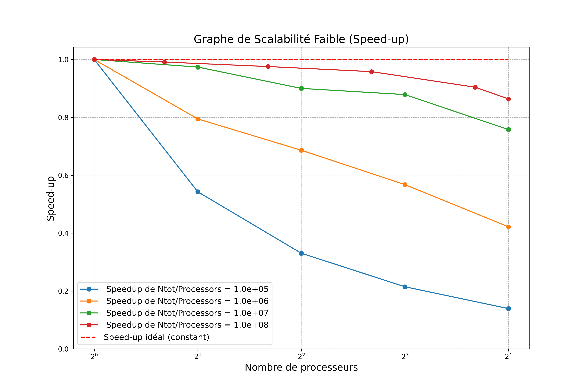
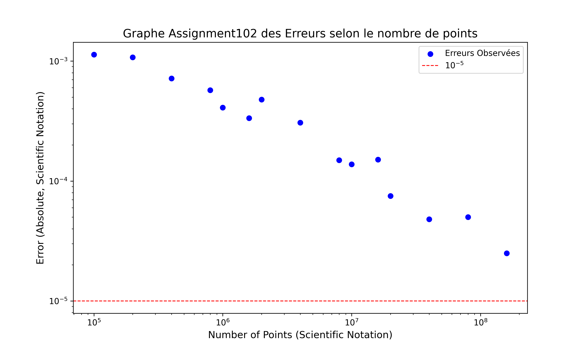
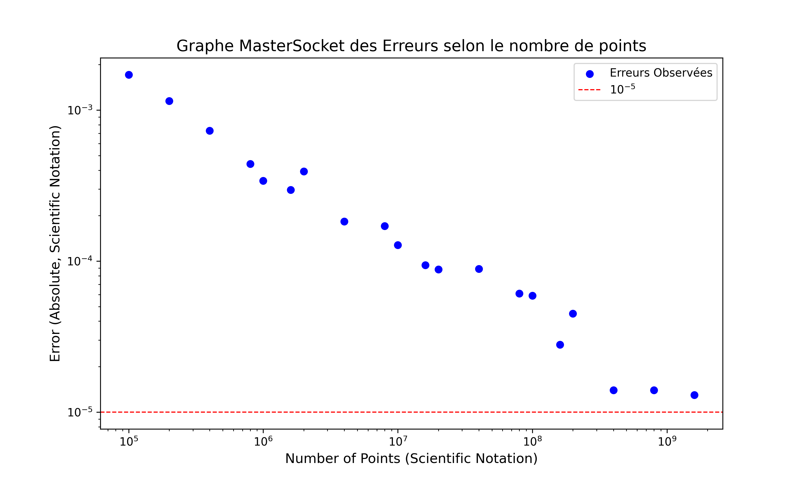
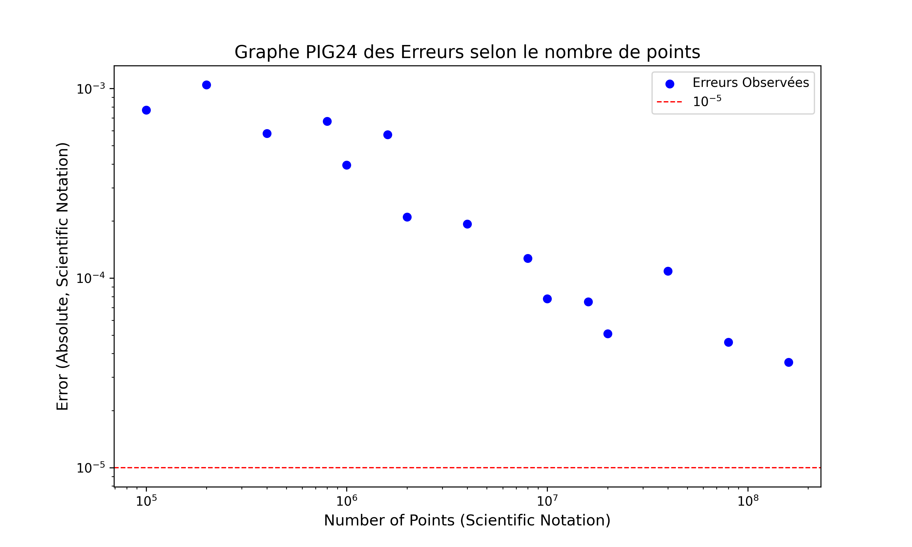

# Rapport Prog Avancée Part 2

## Introduction
Ce rapport présente les travaux réalisés dans le cadre de la deuxième partie du projet de Programmation Avancée, combinant analyses théoriques et implémentations pratiques. Il s'appuie sur des notes personnelles et a été partiellement rédigé avec l'aide de ChatGPT pour structurer et formuler certaines sections.

Les travaux explorent plusieurs aspects de la programmation parallèle et distribuée. La méthode Monte Carlo est utilisée pour estimer la valeur de π, avec une analyse détaillée des algorithmes et des techniques de parallélisation mises en œuvre. L'implémentation débute sur une machine à mémoire partagée, suivie d'une évaluation des performances pour le calcul de π et l'Assignment 102. Ensuite, l'algorithme Monte Carlo est adapté à un environnement à mémoire distribuée, et une architecture Master-Worker basée sur des sockets est développée.

Enfin, le code Master-Worker est déployé et testé sur plusieurs machines afin d’évaluer les performances dans un contexte réel. Chaque étape de ce projet met en lumière les défis et les avantages de la programmation avancée, en particulier dans des environnements parallèles et distribués.

## I. Monte Carlo pour calculer π

Soit l'aire `A_quartD` d'un quart de disque de rayon 1 :

```
A_quartD = (π * r^2) / 4
```

Pour un carré de côté `r = 1`, l'aire `A_c` est :

```
A_c = r^2 = 1
```

On considère des points `X_p(x_p, y_p)` dont les coordonnées sont tirées uniformément dans l'intervalle `]0,1[`.

La probabilité que `X_p` appartienne au quart de disque est :

```
P = A_quartD / A_c = π / 4
```

En effectuant `n_tot` tirages aléatoires, soit `n_cible` le nombre de points situés dans le quart de disque. Si `n_tot` est grand, on peut estimer `P` par :

```
P ≈ n_cible / n_tot ≈ π / 4
```

D'où :

```
π ≈ 4 * n_cible / n_tot
```
### Image : Schéma de MonteCarlo 


## II. Algorithme et parallélisation.

```python
ncible = 0
for (p = 0| n_tot > 0; n_tot--) {
    xp = rand()  # Loi U(]0,1[)
    yp = rand()
    if ((xp**2 + yp**2) < 1) {
        ncible += 1
    }
}
π = 4 * ncible / n_tot
```

### Tâches

1. **T0 : Tirer et compter `n_tot` points**
    - **T0p : Tirer un point**
        1. **T0p1 : Tirer `X_p` et `Y_P`**
        2. **T0p2 : Incrémenter `n_cible`**

2. **T1 : Calculer `π`**

### Dépendances entre tâches :
- `T1` dépend de `T0`
- `T0p2` dépend de `T0p1`
- Les instances de `T0p1` sont indépendantes entre elles.
- Les instances de `T0p2` sont indépendantes entre elles.

### Ressource critique et section critique :
- **`n_cible`** est une ressource critique.
- **Section critique** : `ncible += 1`.
### Conclusion 
Nous pouvons en conclure que les instances de TOp1 peuvent être entièrement parallélisées, car elles sont indépendantes les unes des autres et ne constituent pas une ressource critique.

###  a. Paradigme Itérations parallels


    ENTRÉES :
    n_tot : nombre total de points
    
    FONCTION TirerPoint()
    xp ← valeur aléatoire entre 0 et 1
    yp ← valeur aléatoire entre 0 et 1
    RETOURNER (xp^2 + yp^2 < 1)
    FIN FONCTION
    
    PROCÉDURE PRINCIPALE
    ncible ← 0
    
        PARALLEL POUR i DE 1 À n_tot
            SI TirerPoint() ALORS
                INCRÉMENTER ncible
            FIN SI
        FIN PARALLEL POUR
    
        π ← 4 * ncible / n_tot
        AFFICHER "Estimation de π : ", π 
    FIN PROCÉDURE

#### Explications :

Tirer un point :

Tirer aléatoirement un point (xp, yp) dans un carré de 1x1 et vérifier s'il est dans un quart de cercle (xp^2 + yp^2 < 1).
Parallélisme :

Les tirages sont effectués simultanément pour accélérer le calcul.

Compter les points :

Incrémenter un compteur ncible pour chaque point dans le quart de cercle.

Estimation de π :

Calculer π avec la formule π ≈ 4 * ncible / n_tot.

### b. Paradigme Master Worker


    ENTRÉES :
    n_tot : nombre total de points
    n_workers : nombre de workers
    
    FONCTION TirerPoint()
    xp ← valeur aléatoire entre 0 et 1
    yp ← valeur aléatoire entre 0 et 1
    RETOURNER (xp^2 + yp^2 < 1)
    FIN FONCTION
    
    FONCTION MonteCarloPartial(n_charge)
    ncible_partial ← 0
    POUR i DE 1 À n_pcharge FAIRE
    SI TirerPoint() ALORS
    ncible_partial ← ncible_partial + 1
    FIN SI
    FIN POUR
    RETOURNER ncible_partial
    FIN FONCTION
    
    PROCÉDURE PRINCIPALE
    n_charge ← n_tot / n_workers
    Liste ncibles ← Liste vide
    
        POUR chaque worker DE 1 À n_workers
            ncible_partial ← MonteCarloPartial(n_charge)
            AJOUTER ncible_partial à ncibles
        FIN POUR
    
        ncible_total ← Somme des valeurs dans ncibles
        π ← 4 * ncible_total / n_tot
        AFFICHER "Estimation de π : ", π
    FIN PROCÉDURE

#### Explications en pseudo-code :

Chaque worker effectue une partie des calculs (calcul de ncible_partial).

Workers :
Chaque worker travaille de manière indépendante, calculant son propre ncible_partial pour un sous-ensemble des points(n_charge).

Collecte des résultats :

Le master collecte les résultats de chaque worker et effectue une somme des ncible_partial.

Estimation de π :

Le master calcule π en utilisant la formule π ≈ 4 * ncible_total / n_tot.

## 3.Mise en oeuvre sur Machine à mémoire partagé 
###  a. Analyse de Assigment102


#### **1. Classes principales**
- **`Assignment102` :** Point d’entrée, initialise le programme et soumet les tâches Monte Carlo au pool de threads.
- **`PiMonteCarlo` :** Chaque instance représente une tâche indépendante effectuant des tirages et mettant à jour un compteur partagé.
- **`MonteCarlo` :** Fournit la logique pour générer des points aléatoires et vérifier leur appartenance au quart de disque.

#### **2. Package `Concurrent`**
Ce package contient les outils nécessaires pour gérer efficacement les threads et la synchronisation.

##### **`Executors`**
- Classe utilitaire statique pour créer et configurer des pools de threads.
- Dans cette implémentation, la méthode **`newWorkStealingPool()`** est utilisée pour générer un **pool de threads adaptatif**, qui :
   - Exploite efficacement tous les cœurs données en paramétres.
   - Distribue dynamiquement les tâches en fonction des besoins pour maximiser les performances.
- **Responsabilité :** Simplifie la configuration initiale du pool de threads.

##### **`ExecutorService`**
- Interface principale pour gérer l'exécution des tâches soumises au pool de threads.
- Permet un contrôle précis sur la gestion du cycle de vie des threads, avec des méthodes comme :
   - **`execute()` :** Lance une tâche immédiatement.
   - **`shutdown()` :** Arrête proprement le pool une fois que toutes les tâches en attente sont terminées.
   - **`isTerminated()` :** Vérifie si toutes les tâches ont été exécutées.
- **Responsabilité :** Fournit une API pour interagir avec le pool créé par `Executors`.

##### ** Role de `Executors` et `ExecutorService`**
- **`Executors` :** Configure et initialise les pools de threads.
- **`ExecutorService` :** Fournit les outils pour gérer les tâches dans ces pools.

##### **`AtomicInteger`**
- Utilisé pour synchroniser l’accès au compteur partagé `nAtomSuccess` (nombre de points dans le quart de disque).
- Méthode clé : **`incrementAndGet()`**, qui effectue une incrémentation atomique pour éviter les conflits entre threads.

#### **3. Paradigme chosi**
##### Modèle utilisé : Itération parallèle.
Chaque tâche Monte Carlo correspond à une itération indépendante, soumise au pool de threads.
Les tâches ne partagent aucune donnée directement entre elles.
##### Programmation parallèle sur mémoire partagée.
Tous les threads partagent le même espace mémoire,
#### **4. Gestion des tâches**
1. **Création des tâches :**
   - Chaque tâche Monte Carlo est encapsulée dans une instance de `PiMonteCarlo` et soumise au pool de threads via `ExecutorService`.

2. **Exécution :**
   - `newWorkStealingPool()` distribue dynamiquement les tâches entre les threads, qui effectuent leurs calculs de manière indépendante.

3. **Synchronisation :**
   - Les threads mettent à jour le compteur atomique partagé (`AtomicInteger`) en cas de succès (point dans le quart de disque).

4. **Arrêt et collecte des résultats :**
   - Après soumission de toutes les tâches, le pool est arrêté avec `shutdown()`, et les résultats sont agrégés pour calculer la valeur finale de Pi.

#### **5. Optimisations possibles**
1. **Compteurs locaux :** Réduire les conflits en utilisant des compteurs locaux pour chaque thread, puis agréger les résultats à la fin (Comme fait le code Master Worker que nous verrons plus tard).
2.  **Comptage inversé :** Compter les points en dehors du quart de disque pour réduire les appels à incrementAndGet(). En comptabilisant les points qui ne sont pas dans le quart de cercle, on réduit la contention sur le compteur atomique, ce qui minimise le goulot d'étranglement. Avec cette approche, seulement 25 % des tâches nécessitent une synchronisation, contre 75 % si l'on comptabilise les points à l'intérieur du quart de cercle.

#### **6. Correspondance avec le pseudo-code de Monte Carlo**
L'implémentation correspond au pseudo-code d'itération parallèle avec les adaptations suivantes :
1. **Gestion des sections critiques** : Le compteur ncible est remplacé par un AtomicInteger pour garantir un accès sécurisé et éviter les conflits entre threads.
2. **Gestion des threads** : Le découplage des tâches est assuré par ExecutorService, permettant une gestion optimale des tâches en parallèle.

###  a. Analyse de Pi.java


#### **1. Classes principales**

- **Pi** : Contient la méthode `main()` qui initialise l'exécution. Elle crée une instance de la classe **Master** et appelle la méthode `DoRun()`.
- **Master** : Gère la distribution des tâches de calcul entre les **Workers**. Elle utilise un **ExecutorService** pour exécuter les tâches en parallèle et agréger les résultats pour calculer la valeur de π.
- **Worker** : Représente une tâche parallèle sous forme de **Callable<Long>**. Chaque **Worker** effectue une partie du calcul Monte Carlo et retourne un **Future<Long>** avec le nombre de points dans le quart de disque pour un sous-ensemble des itérations.


#### **2. Package `Concurrent`**

- **ExecutorService** : Interface qui gère l'exécution des tâches. Elle permet de soumettre des tâches parallèles et de gérer leur exécution via des pools de threads.
    - **`invokeAll()`** : Cette méthode permet d'exécuter toutes les tâches **Callable** dans une liste de manière parallèle. Elle bloque jusqu'à ce que toutes les tâches soient terminées et retourne une liste de **Future** représentant les résultats des tâches. Dans notre cas, elle est utilisée pour soumettre les **Workers** au pool de threads, permettant ainsi l'exécution parallèle des tâches.

- **Executors** : Classe utilitaire qui permet de créer des instances d'**ExecutorService**, en particulier avec **newFixedThreadPool()** qui crée un pool de threads fixe pour gérer les tâches des **Workers**.

- **Future** : Un objet représentant un calcul dont le résultat sera disponible dans le futur. Chaque **Worker** renvoie un **Future<Long>** avec le résultat partiel. L'appel à `Future.get()` bloque l'exécution du thread principal jusqu'à ce que le calcul soit terminé.

- **Callable** : Interface similaire à **Runnable**, mais qui permet de retourner un résultat. Dans notre cas, chaque **Worker** est un **Callable<Long>** qui calcule le nombre de points tombant dans le quart de disque pour une portion des itérations.


#### **3. Paradigme choisi**

Le paradigme choisi repose sur le modèle **Master/Worker**. Le **Master** distribue les tâches aux **Workers**, et chaque **Worker** effectue les calculs en parallèle pour estimer la valeur de π. Une fois tous les résultats partiels collectés, le **Master** les agrège pour obtenir la valeur finale.


#### **4. Gestion des tâches**

- **ExecutorService** : Le calcul est distribué entre les **Workers** via un pool de threads fixe, géré par un **ExecutorService**. Chaque tâche de calcul est représentée par un **Callable<Long>** et est soumise au pool de threads pour une exécution parallèle.

- **Future** : Chaque tâche retourne un **Future<Long>**, ce qui permet de récupérer les résultats de manière synchrone. L'appel à `Future.get()` bloque le thread principal jusqu'à ce que tous les calculs soient terminés, garantissant ainsi une synchronisation des résultats.


#### **5 Comparaisons avec Assigment 102**
1. Simplicité
   Assignment 102 est plus simple, avec un modèle direct utilisant des threads et un compteur atomique. Cela le rend facile à comprendre et à implémenter.

2. Efficacité
   Pi.java est plus efficace, car il minimise la synchronisation et utilise les Futures et l'ExecutorService pour gérer les tâches de manière fluide et éviter les goulots d'étranglement.

3. Parallélisme
   Pi.java exploite mieux le parallélisme, en distribuant les tâches avec ces Workers qui travaille de maniére indépendante et non pas besoin d'attendre que d'autres taches finis.


#### **6. Correspondance avec le pseudo-code de Monte Carlo**

L'implémentation suit le pseudo-code de Monte Carlo avec les adaptations suivantes :

- **Master** : La classe **Master** divise `n_tot` en sous-tâches égales entre les **Workers**. Chaque **Worker** exécute la fonction `MonteCarloPartial(n_charge)` et retourne un **Future**. Le **Master** utilise un **ExecutorService** (FixedThreadPool) pour gérer l'exécution parallèle des tâches et collecter les résultats via `Future.get()`.

- **Workers** : Chaque **Worker** est un **Callable** qui effectue une partie du calcul en comptant les points dans le quart de disque. Le **Future** retourné permet de récupérer le résultat lorsque le calcul est terminé.

- **ExecutorService** : Le **ExecutorService** gère le pool de threads et assure l'exécution parallèle des tâches. Il permet de simplifier la gestion des threads et la synchronisation des résultats avec les **Futures**.

- **Division équivalente** : Le nombre total de tirages (`n_tot`) est divisé entre les **Workers** de manière égale (`n_charge = n_tot / n_workers`).

- **Agrégation des résultats** : Les résultats des **Workers** sont récupérés via les **Futures** et agrégés pour calculer l'estimation finale de π, avec `π = 4 * ncible_total / n_tot`.

##  4.Analyse des performances de Pi et Assigment 102

Nous comparerons l’efficacité des implémentations Pi.java et Assignment 102 en analysant deux aspects :

**Scalabilité forte** : Elle évalue les performances lorsque le nombre de threads augmente, mais que le nombre total de points reste fixe. Cet aspect permet de voir si chaque implémentation utilise efficacement les ressources multiprocesseurs disponibles.

**Scalabilité faible** : Elle mesure la capacité d’un programme à maintenir des performances constantes lorsque le nombre total de points augmente proportionnellement au nombre de threads. Cela reflète l’efficacité de la gestion des charges de travail croissantes.

Pour les tests, nous choisirons un total de points de 10^6, 10^7 et 10^8 * 1,6. Cette sélection permet d’analyser l’impact de la charge de travail sur les performances tout en garantissant une granularité suffisante pour observer les différences. Les valeurs inférieures (10 à 10^5) ne seront pas analysées, car les temps d’exécution sont presque équivalents et peu significatifs. De plus, multiplier par 16 permet de tester la scalabilité avec différents nombres de threads : 1, 2, 4, 8 et 16.

Pour le calcul de la scalabilité, nous représentons en abscisse (axe horizontal) le nombre de processeurs/threads utilisés et en ordonnée (axe vertical) le **speedup**.

Le **speedup** mesure l'accélération obtenue grâce à la parallélisation. Il se calcule à l'aide de la formule suivante :

**Speedup = T1 / Tp**,

où :
- **T1** est le temps d'exécution en mode séquentiel (1 thread),
- **Tp** est le temps d'exécution avec *p* threads.

Un speedup idéal (linéaire) en **scalabilité forte** se traduit par une courbe où la valeur double lorsque le nombre de threads double, pour une taille de problème fixe. Cela reflète une parfaite répartition du travail entre les threads.

En **scalabilité faible**, le speedup est observé en augmentant à la fois la taille du problème et le nombre de threads de manière proportionnelle. Ici, un speedup linéaire indique que le système maintient une efficacité constante malgré l'augmentation de la charge.

### Automatisation des tests et leurs traitements

Il ya des scripts  permettant d'automatiser les tests pour évaluer les performances de **scalabilité forte** et **scalabilité faible**.

- **Script `script_scalabilite_forte.bat`** :  
  Ce script divise le nombre total de points (**$TOTAL_POINTS**) de manière fixe et fait varier le nombre de threads (**$THREAD_COUNTS**). Il exécute chaque configuration plusieurs fois (**$REPEAT_COUNT**) pour garantir des mesures fiables. Les résultats sont enregistrés dans des fichiers CSV distincts pour les programmes **Pi** et **Assignment102**.

- **Script `script_scalabilite_faible.bat`** :  
  Ici, le script augmente proportionnellement le nombre total de points avec le nombre de threads. Chaque **thread** traite une charge de travail fixe (**$pointsParTravailleur**), simulant une augmentation uniforme de la taille du problème. Les fichiers CSV collectent les résultats pour analyser l'efficacité parallèle.

Pour le traitement on utilise la classe PiAverageToCsv qui  permet de calculer la moyenne des résultats pour chaque configuration de test, en regroupant les 5 répétitions effectuées. Cela facilite l'analyse en lissant les données pour chaque expérience.

Avec les résultats obtenus sous forme de fichiers CSV, j'utilise un code Python pour calculer le speed-up et tracer les graphes correspondants. Ce script extrait les données, calcule le speed-up en comparant le temps d'exécution avec un seul processeur à celui avec plusieurs processeurs, et génère un graphique montrant la scalabilité forte et faible, avec une courbe pour chaque valeur unique de Ntot. Les graphes incluent également une référence au speed-up idéal pour évaluer l'efficacité parallèle.

### Architecture matérielle choisie pour lancer les tests

- **Processeur** : Intel Core i9-129000KF
    - 16 cœurs physiques
    - 24 threads
    - Fréquence de base : 3,2GHz
    - Architecture 64 bits

- **Mémoire RAM** : 32 Go

Cette architecture est également utilisée pour les tests décrits dans la partie 6.

### Rapport avec la norme Iso

#### Calcul du Time et du Task Time

Dans l’évaluation des performances, deux approches peuvent être utilisées pour définir le temps cible (Tt) et le temps mesuré (Ta) :

1. **Comparaison avec un code séquentiel**
    - Le temps cible (Tt) est égal au temps d’exécution avec un seul processeur, soit T1.
    - Le temps mesuré (Ta) est égal au temps d’exécution parallèle avec p processeurs, soit Tp.

   Cette approche permet de mesurer directement l’amélioration apportée par le parallélisme par rapport à une exécution séquentielle.

2. **Parallélisme idéal (notre choix)**
    - Le temps cible (Tt) est défini comme Tp, ce qui correspond au temps  idéal, c’est-à-dire le temps théorique si le parallélisme était parfait.
    - Le temps mesuré (Ta) est défini comme Tp, soit le temps réel mesuré avec p processeurs.

   Cette approche permet d’évaluer dans quelle mesure le code parallèle se rapproche du parallélisme idéal.

#### Calcul de l’efficacité selon la norme ISO/IEC 25022:2012

Conformément à la norme ISO/IEC 25022:2012, l’efficacité peut être calculée avec la formule suivante :
- Efficacité = Tt/Ta * 100

    - Tt représente le temps cible, soit Temps idéal paralélle  dans notre cas.
    - Ta représente le temps mesuré, soit Tp.
on pourrait aussi utiliser la 

Cette formule mesure l'efficacité du programme plus le pourcentage est grand mieux c'est.

une autre formule possible pour calculer l'efficacité c'est  (Tt - Ta)/Tt et Tt = (1/p)*T1

La formule du Time correspond à
- TT/ta
 ce qui correspond au speedup précedemment écrit. Le time va comparer le code séqeuntiel au temps paralléle


### Effectiveness selon la norme ISO/IEC 25022:2012

Cette fois-ci, au lieu d'utiliser la métrique du temps pour évaluer les performances, nous allons utiliser la **métrique de l'erreur**. Cette approche nous permet de mesurer l'écart entre la valeur calculée par notre code de Monte Carlo et la valeur réelle (ici, \( \pi \)) en fonction du nombre d'itérations (ou du nombre total de points générés).

La formule de l'erreur est la suivante :
- **Erreur = Math.abs((value - Math.PI)) / Math.PI**

Où :
- **value** est la valeur estimée par le code de Monte Carlo pour pi.
- **Math.PI** est la valeur réelle de pi .

L'objectif ici est de vérifier comment l'erreur évolue à mesure que le nombre d'itérations augmente. En général, plus le nombre de points générés (et donc le nombre d'itérations) est élevé, plus l'estimation de pi devrait se rapprocher de la valeur réelle, et l'erreur devrait diminuer.
Cela revient aussi à calculer le trust/la fiabilité du code (dans la section satisfaction de Quality in Use) des algorithmes.
Nous analyserons le trust dans les expériences reliées à la scalabilité faible car ces tests comportent une plus grande variété de points.

### Expérience 1 : calcul de la stabilité forte (Code : assigment102 : Nombre de Points : 10^6,10^7,10*8 *1,6  Nombre de processeurs : 1,2,4,8,16)


|PI|Difference|Error|Ntot|AvailableProcessors|TimeDuration(ms)|Efficacité (%)
|--|----|----|----|----|----|---|
3.141111|-0.000482|0.000391|1600000.0|1.0|134.2|100.0
3.140829|-0.000764|0.000407|1600000.0|2.0|269.6|24.888724035608302
3.142022|0.000429|0.000381|1600000.0|4.0|306.2|10.956890920966687
3.141752|0.000159|0.000209|1600000.0|8.0|424.8|3.948917137476459
3.142113|0.00052|0.000309|1600000.0|16.0|583.2|1.4381858710562412
3.141616|2.3e-05|9.5e-05|16000000.0|1.0|1211.2|100.0
3.141843|0.00025|8.9e-05|16000000.0|2.0|2616.8|23.14276979516967
3.141547|-4.6e-05|5.4e-05|16000000.0|4.0|2861.4|10.582232473614313
3.141543|-5e-05|0.000102|16000000.0|8.0|3653.4|4.144084961953249
3.141485|-0.000108|7.9e-05|16000000.0|16.0|4972.4|1.5224036682487332
3.141697|0.000104|3.3e-05|160000000.0|1.0|12522.6|100.0
3.14158|-1.2e-05|1.6e-05|160000000.0|2.0|25139.0|24.906718644337484
3.141554|-3.9e-05|3.1e-05|160000000.0|4.0|28992.6|10.798100204879866
3.141611|1.8e-05|3.6e-05|160000000.0|8.0|35252.4|4.4403359771249615
3.141586|-7e-06|2.1e-05|160000000.0|16.0|46755.6|1.6739438698252187

### Observations du graphe


- **Speed-up inférieur à 1** :  
  Le graphe révèle un **Speed-up inférieur à 1** dans certains cas, ce qui est aberrant, car cela signifie que l'ajout de processeurs ralentit l'exécution au lieu de l'accélérer.

- **Écart massif avec le Speed-up idéal** :  
  Toutes les courbes sont largement en-dessous des courbes idéales, indiquant une inefficacité critique du parallélisme.

#### Cause 

Le goulet d'étranglement causé par un `atomic integer` force les threads à attendre les uns les autres, annulant les bénéfices du parallélisme.

#### Conclusion
Assignment 102 montre une scalabilité fortement limitée, voire contre-productive, mettant en évidence un problème majeur de synchronisation et de gestion des tâches parallèles.


### Expérience 2 : calcul de la stabilité forte (Code : Pi : Nombre de Points : 10^6,10^7,10^8*1,6  Nombre de processeurs : 1,2,4,8,16)
PI|Difference|Error|Ntot|AvailableProcessors|TimeDuration(ms)|Efficacité (%)
|---|---|-----|-----|----|----|---|
3.1413|-0.000293|0.000334|1600000.0|1.0|46.0|100.0
3.141822|0.000229|0.000466|1600000.0|2.0|34.2|67.25146198830409
3.141238|-0.000355|0.000218|1600000.0|4.0|26.2|43.89312977099237
3.141373|-0.00022|0.000446|1600000.0|8.0|38.6|14.896373056994818
3.141745|0.000152|0.000413|1600000.0|16.0|58.4|4.9229452054794525
3.141868|0.000276|0.000171|16000000.0|1.0|420.6|100.0
3.14184|0.000247|8.5e-05|16000000.0|2.0|224.4|93.71657754010695
3.141374|-0.000218|0.000143|16000000.0|4.0|129.4|81.2596599690881
3.141499|-9.4e-05|7e-05|16000000.0|8.0|85.4|61.56323185011709
3.14157|-2.3e-05|0.000156|16000000.0|16.0|70.8|37.1292372881356
3.141577|-1.6e-05|4.5e-05|160000000.0|1.0|4162.2|100.0
3.141465|-0.000128|4.1e-05|160000000.0|2.0|2177.0|95.59485530546623
3.141636|4.4e-05|5e-05|160000000.0|4.0|1141.8|91.13242249080399
3.141479|-0.000113|3.6e-05|160000000.0|8.0|592.6|87.79530880863989
3.141479|-0.000113|4e-05|160000000.0|16.0|349.2|74.49527491408935

### Observations du graphe


- **Tendance globale** :  
  Le Speed-up augmente avec le nombre de processeurs, ce qui est attendu en scalabilité forte. Cependant, un écart se creuse entre le Speed-up observé et le Speed-up idéal lorsque le nombre de processeurs devient important, surtout pour les petites tailles de charge (`Ntot`).

- **Influence de la taille de la charge (`Ntot`)** :
    - Pour des valeurs faibles de `Ntot` (par exemple, (1.6 x 10^6)), le Speed-up plafonne rapidement, ce qui indique une surcharge de communication ou un déséquilibre entre calcul et synchronisation.
    - Avec des tailles moyennes de `Ntot` (1.6 x10^7), le Speed-up s'améliore mais reste limité à cause des coûts de synchronisation.
    - Pour de grandes tailles de charge (1.6 x 10^8), le Speed-up se rapproche du comportement idéal, surtout avec un petit nombre de processeurs, ce qui montre une bonne scalabilité dans ce cas.

- **Limites de scalabilité** :  
  Lorsque le nombre de processeurs devient élevé (par exemple, (2^4 = 16)), les courbes montrent un ralentissement ou un plafonnement du Speed-up, en particulier pour des charges faibles, où les frais de communication deviennent dominants.

#### Conclusion

Le code PI en Java présente une **bonne scalabilité forte**, particulièrement pour des charges importantes (\(Ntot\) élevé). Le Speed-up atteint des valeurs proches du comportement idéal.

### Expérience 3 : calcul de la stabilité faible (Code : Assigment102 : Nombre de Points : 10^6,10^7,10^8*1,6  Nombre de processeurs : 1,2,4,8,16)
| PI   | Difference | Error | Ntot      | AvailableProcessors | TimeDuration(ms) |
|------|------------|-------|-----------|---------------------|------------------|
3,139704|-0,001889|0,001133|100000,000000|1,000000|20,400000
3,142080|0,000487|0,001075|200000,000000|2,000000|49,800000
3,140820|-0,000773|0,000718|400000,000000|4,000000|97,200000
3,140646|-0,000947|0,000573|800000,000000|8,000000|252,000000
3,141150|-0,000443|0,000334|1600000,000000|16,000000|588,800000
3,140799|-0,000794|0,000410|1000000,000000|1,000000|87,000000
3,142627|0,001034|0,000478|2000000,000000|2,000000|337,400000
3,141922|0,000329|0,000307|4000000,000000|4,000000|723,800000
3,141514|-0,000079|0,000149|8000000,000000|8,000000|1848,000000
3,141333|-0,000259|0,000151|16000000,000000|16,000000|4927,200000
3,141998|0,000406|0,000138|10000000,000000|1,000000|764,600000
3,141504|-0,000089|0,000075|20000000,000000|2,000000|3135,600000
3,141547|-0,000046|0,000048|40000000,000000|4,000000|7026,600000
3,141438|-0,000155|0,000050|80000000,000000|8,000000|17643,400000
3,141620|0,000028|0,000025|160000000,000000|16,000000|48216,800000


### Observations du graphe



- **Diminution rapide du Speed-up** :  
  Le Speed-up décroît de manière significative à mesure que le nombre de processeurs augmente, suggérant que les coûts de communication surpassent largement les gains de parallélisme.

- **Influence de la charge** :
    - Même pour des charges importantes (\(Ntot / Processors = 10^7\)), le Speed-up reste très éloigné de l'idéal.
    - Pour des charges faibles (\(Ntot / Processors = 10^5\)), la situation empire, car le ratio calcul de la tache / communications entre les threads s'approche de 0 .

- **Écart avec le Speed-up idéal** :  
  Toutes les courbes montrent une divergence notable par rapport au Speed-up idéal, indiquant que l'ajout de processeurs est contre-productif dans ce contexte.


#### Cause 
La mauvaise scalabilité est attribuée à un **déséquilibre entre les coûts de communication et le calcul**. L'**assignment 102** semble exiger une quantité excessive de synchronisations ou d'échanges de données entre les processeurs, rendant les gains de parallélisme insignifiants (renforcé par le goulot d'étranglement qui fait encore plus perdre de l'intêret au parallélisme).

#### Conclusion
L'**assignment 102** illustre une inefficacité critique en scalabilité faible.

### Expérience 4 : calcul de la stabilité faible (Code : Pi : Nombre de Points : 10^6,10^7,10^8*1,6  Nombre de processeurs : 1,2,4,8,16)
| PI   | Difference | Error | Ntot       | AvailableProcessors | TimeDuration(ms) |
|------|------------|-------|------------|---------------------|------------------|
3,138944|-0,002649|0,001302|100000,000000|1,000000|7,600000
3,139420|-0,002173|0,001274|200000,000000|2,000000|14,000000
3,142838|0,001245|0,000414|400000,000000|4,000000|23,000000
3,143275|0,001682|0,000755|800000,000000|8,000000|35,400000
3,142543|0,000950|0,000397|1600000,000000|16,000000|54,600000
3,141418|-0,000175|0,000588|1000000,000000|1,000000|30,200000
3,141880|0,000287|0,000146|2000000,000000|2,000000|38,000000
3,141517|-0,000076|0,000289|4000000,000000|4,000000|44,000000
3,141805|0,000212|0,000143|8000000,000000|8,000000|53,200000
3,141448|-0,000145|0,000132|16000000,000000|16,000000|71,600000
3,141364|-0,000228|0,000167|10000000,000000|1,000000|268,400000
3,141510|-0,000082|0,000087|20000000,000000|2,000000|275,600000
3,141520|-0,000073|0,000086|40000000,000000|4,000000|298,200000
3,141522|-0,000070|0,000044|80000000,000000|8,000000|305,400000
3,141538|-0,000055|0,000035|160000000,000000|16,000000|354,200000

### Observations générales 



1. **Bonne Scalabilité pour les Charges Importantes :**
    - Pour \(Ntot/Processors = 10^7\), le graphe montre que le **Speed-up reste proche de l’idéal** (bien qu'en dessous), ce qui indique que le ratio **calcul/communication** est favorable. Cela signifie que les **workers effectuent une quantité importante de calculs**, ce qui réduit l’impact des communications avec le master.

2. **Diminution pour les Petites Charges :**
    - Avec \(Ntot/Processors = 10^5\), le **Speed-up diminue considérablement**. Cela s’explique par un **ratio calcul/communication faible**, où le temps de calcul devient négligeable par rapport aux coûts de synchronisation et d’échanges de données entre le master et les threads.

3. **Observation par rapport au Speed-up idéal :**
    - Le **Speed-up réel diverge progressivement du Speed-up idéal** à mesure que le nombre de processeurs augmente. Toutefois, pour les **grosses charges**, cette divergence est limitée, ce qui indique une **scalabilité bonne **.

#### Cause de la Bonne Scalabilité
Le **paradigme master-worker** bien que le code  à des coûts de synchronisation, reste efficace pour le code **PI.java** lorsque :
- **Les charges de calcul sont importantes** (\(Ntot/Processors\) élevé). Ici, les threads exécutent de nombreux calculs indépendants, augmentant le **ratio calcul/communication**.
- La parallélisation des calculs Monte Carlo répartit les tâches de manière uniforme entre les workers, ce qui réduit les déséquilibres.

Cependant, pour les **petites charges**, les communications entre threads surpassent les bénéfices du calcul parallèle, ce qui provoque une diminution notable du Speed-up.

#### Conclusion
Le code **PI.java** démontre une **bonne scalabilité faible**, particulièrement pour des charges importantes :
- **Pour les grosses charges (\(Ntot/Processors = 10^7\))** : Le **ratio calcul/communication** élevé compense largement les coûts de synchronisation.
- **Pour les petites charges (\(Ntot/Processors = 10^5\))** : Le **Speed-up décroît**, car les communications dominent, rendant la parallélisation moins efficace.


### Comparaison Finale entre PI.java et Assigment102

- **Scalabilité forte :** PI.java gère mieux l’augmentation du nombre de threads avec une charge fixe, limitant les goulots d'étranglement grâce à une répartition efficace des tâches. Assignment 102, en revanche, souffre de synchronisations excessives et d'une surcharge de communication qui réduisent les gains.

- **Scalabilité faible:** PI.java maintient des performances plus constantes lorsque la charge augmente proportionnellement au nombre de threads. Il exploite efficacement les ressources multiprocesseurs, contrairement à Assignment 102, qui peine à équilibrer calcul et communication.

#### Comparaison du trust

### Légende : Graphe des erreurs du Pi


### Légende : Graphe des erreurs de Assignment 102


##### Analyse de la convergence :
Les deux algorithmes montrent **la même tendance générale** et possèdent une **fiabilité équivalente**.

- **Tendance générale** : L'erreur diminue systématiquement lorsque le nombre de points augmente.
- **Zone des erreurs** :
    - Pour environ **10^3 points**, l'erreur est proche de 10^-2.
    - À **10^6 points**, l'erreur atteint environ 10^-3.
    - Vers **10^8 points**, l'erreur descend sous 10^-4.
- Cette évolution confirme que les deux méthodes suivent une **convergence en 1 / racine(N)**, typique de Monte Carlo : plus on ajoute de points, plus l'erreur se réduit, mais de façon lente.

##### Conclusion  Trust:
Les deux graphes présentent quasiment **la même convergence** et démontrent la **même fiabilité du code**. La diminution progressive de l'erreur prouve que les deux algorithmes s'améliorent avec l'augmentation du nombre de points.
#### Conclusion :
PI.java présente une **meilleure scalabilité forte et faible** que Assignment 102, ce qui en fait une implémentation **plus performante et adaptée** aux architectures parallèles, particulièrement pour des charges croissantes ou un grand nombre de threads. Mais cependant les deux codes possédent la même fiabilité 

## 5. Mise en oeuvre de MonteCarlo en mémoire distribué 

### Illustration


### **Présentation de la Conception**

L'architecture décrite est une **programmation distribuée** basée sur le modèle **Master-Worker**. Les **Workers** communiquent avec le **Master** via des **sockets** pour répartir les tâches et récupérer les résultats.

- **MasterSocket** : Le **Master** coordonne l'exécution, distribue les tâches aux **Workers**, récupère leurs résultats partiels et les fusionne pour obtenir le résultat final. La communication entre le **Master** et les **Workers** se fait via un **socket**.

- **WorkerSocket** : Chaque **Worker** reçoit des instructions du **MasterSocket**, exécute les calculs Monte Carlo en appelant la méthode du **Master** (dans la classe `PI.java`), et retourne les résultats au **Master**.

- **ServerSocket** : Ce **socket** est responsable de gérer les connexions réseau, permettant au **Master** d'accepter les connexions des **Workers**.

- **Classes I/O (BufferedReader, PrintWriter)** : Ces classes facilitent l'échange de données entre le **Master** et les **Workers** à travers des flux de données.

- **IOException** : Gère les erreurs de communication, tant pour les sockets que pour les flux d'entrée et de sortie.


### **Le Paradigme : Programmation Distribuée et Multiniveaux**

Le système repose sur un modèle **Master-Worker** en **programmation distribuée**. Les **Workers** et le **Master** échangent des données via des **sockets**.

Cependant, la dimension **multiniveaux** entre en jeu lorsque les **Workers** appellent le **Master** de `PI.java`, où le calcul Monte Carlo est effectué via un **thread** dans un environnement parallèle. Ainsi, le système devient non seulement distribué (grâce à la communication via des **sockets**), mais aussi multiniveaux, car un niveau de traitement parallèle (via le **Master** et les **Workers**) est imbriqué dans l'architecture.

En résumé, il s'agit d'une **programmation distribuée** utilisant des **sockets** pour la communication entre le **Master** et les **Workers**, avec une **programmation multiniveaux** lorsque les **Workers** interagissent avec le **Master** de PI.java dans un environnement parallèle.

## 6. Performance MasterWorker Socket

### Expérience 1 : calcul de la stabilité forte (Code : MasterSocket : Nombre de Points : 10^6,10^7,10*8 *1,6  Nombre de processeurs : 1,2,4,8,16)

| PI       | Difference | Error    | Ntot              | AvailableProcessors | TimeDuration (ms) | Efficacité (%)|
|----------|------------|----------|-------------------|---------------------|-------------------| --------------|
3.141173|-0.00042|0.000294|1600000.0|1.0|57.066667|100.0
3.141737|0.000144|0.000423|1600000.0|2.0|31.466667|90.67796567078426
3.141513|-8e-05|0.000338|1600000.0|4.0|19.933333|71.57190796942989
3.141787|0.000194|0.000195|1600000.0|8.0|11.733333|60.79545662771184
3.140975|-0.000618|0.000447|1600000.0|16.0|15.0|23.77777791666667
3.141639|4.7e-05|0.000103|16000000.0|1.0|490.466667|100.0
3.141688|9.6e-05|0.000112|16000000.0|2.0|246.866667|99.33837422449584
3.141731|0.000138|9.6e-05|16000000.0|4.0|125.866667|97.41790235058816
3.141549|-4.4e-05|7.9e-05|16000000.0|8.0|73.666667|83.22398158043445
3.141588|-5e-06|9.9e-05|16000000.0|16.0|47.8|64.13005583158996
3.141594|1e-06|4.2e-05|160000000.0|1.0|4765.333333|100.0
3.141627|3.4e-05|3e-05|160000000.0|2.0|2391.133333|99.64591407835138
3.141602|9e-06|2.8e-05|160000000.0|4.0|1206.133333|98.77293833566574
3.141588|-5e-06|3.8e-05|160000000.0|8.0|620.4|96.0133247300129
3.141569|-2.3e-05|3.1e-05|160000000.0|16.0|359.533333|82.83886526663161


#### Observations générales :


1. **Tendance globale :**
    - Le Speed-up augmente avec le nombre de processeurs pour toutes les tailles de charge (\(N_{tot}\)).
    - Plus N_{tot} est élevé, plus le Speed-up observé se rapproche du Speed-up idéal.

2. **Influence de la taille de la charge (\(N_{tot}\)) :**
    - Pour N_tot = 1.6 * 10^6) (courbe bleue) :
        - Le Speed-up plafonne rapidement et diminue après 8 processeurs.
        - Cela indique une surcharge de communication et une charge de calcul insuffisante par processeur.
    - Pour N_tot = 1.6 * 10^7) (courbe orange) :
        - Le Speed-up est meilleur, mais reste en dessous de l'idéal, avec un ralentissement visible à partir de 8 processeurs.
    - Pour N_tot = 1.6*times 10^8) (courbe verte) :
        - Le Speed-up se rapproche du comportement idéal jusqu'à 16 processeurs, montrant une bonne scalabilité pour cette taille de charge.

3. **Écart avec le Speed-up idéal :**
    - L'écart entre le Speed-up observé et idéal augmente avec un petit \(N_{tot}\), ce qui montre que les frais généraux de communication deviennent dominants pour des charges faibles.

#### Interprétation des résultats :
- **Surcharge de communication :**
    - Le modèle MasterWorker docket implique des échanges constants entre le master et les workers via des sockets. Pour des petites charges (N_tot = 1.6 * 10^6)), ces frais de communication surpassent le gain de parallélisme.

- **Déséquilibre calcul/communication :**
    - Avec des charges plus importantes (N_tot = 1.6 * 10^8)), la part de communication devient négligeable face au temps de calcul, ce qui explique la meilleure scalabilité.

#### Conclusion :
Le modèle **MasterWorker** montre une **bonne scalabilité forte** pour des charges élevées.

### Expérience 2 : calcul de la stabilité faible (Code : MasterSocket : Nombre de Points : 10^6,10^7,10*8 *1,6  Nombre de processeurs : 1,2,4,8,16)

| PI       | Difference | Error    | Ntot              | AvailableProcessors | TimeDuration (ms) |
|----------|------------|----------|-------------------|---------------------|-------------------|
3,142757|0,001164|0,001715|100000,000000|1,000000|7,000000
3,139159|-0,002434|0,001148|200000,000000|2,000000|8,666667
3,141306|-0,000287|0,000732|400000,000000|4,000000|9,133333
3,142230|0,000637|0,000441|800000,000000|8,000000|11,466667
3,142010|0,000417|0,000296|1600000,000000|16,000000|14,800000
3,141658|0,000065|0,000341|1000000,000000|1,000000|33,466667
3,141141|-0,000452|0,000392|2000000,000000|2,000000|36,000000
3,141809|0,000216|0,000183|4000000,000000|4,000000|38,666667
3,141421|-0,000172|0,000171|8000000,000000|8,000000|40,866667
3,141600|0,000007|0,000094|16000000,000000|16,000000|47,666667
3,141617|0,000024|0,000128|10000000,000000|1,000000|290,266667
3,141607|0,000015|0,000088|20000000,000000|2,000000|297,800000
3,141565|-0,000028|0,000089|40000000,000000|4,000000|300,533333
3,141599|0,000007|0,000061|80000000,000000|8,000000|313,866667
3,141609|0,000016|0,000028|160000000,000000|16,000000|369,066667


#### Analyse du graphe (Scalabilité faible - MasterWorker) :


1. **Charges faibles (\(Ntot/Processors = 10^5\))** :
    - Performance très médiocre : le Speed-up chute rapidement avec l'augmentation des processeurs.
    - Les coûts de communication (latence, synchronisation) surpassent largement les bénéfices du parallélisme.

2. **Charges élevées (\(Ntot/Processors = 10^7\))** :
    - Bonne performance : le Speed-up reste plus stable, car le temps de calcul compense les coûts de communication.

3. **Charge intermédiaire (\(Ntot/Processors = 10^6\))** :
    - Résultat mitigé, entre les deux cas.

#### Causes principales :
- **Latence des sockets** : Dominante pour les petites charges.
- **Ratio calcul/communication** : Amélioré pour des charges élevées.

#### Conclusion :
Le modèle MasterWorker est inefficace pour les charges faibles mais performant pour les charges élevées, où le calcul amortit les coûts de communication.

### **Comparaison MasterSocket vs Pi :**

- **MasterSocket** utilise des **sockets** et une **mémoire distribuée**, ce qui est plus adapté pour gérer des charges lourdes et des communications entre nœuds.
- **Pi** utilise la **mémoire partagée** avec **ExecutorService** et **Future**, plus efficace pour les petites charges mais limité pour les grandes.

#### Comparaison du trust
##### Légende : Graphe des erreurs de MasterSocket

La courbe est legerement meilleur que la courbe de PI mais cela reste la convergence. 


### Conclusion:
- **Scalabilité forte** : MasterSocket gère mieux l’augmentation du nombre de threads avec une charge fixe grâce à la mémoire distribuée et aux sockets.
- **Scalabilité faible** : MasterSocket maintient des performances plus constantes lorsque la charge augmente proportionnellement au nombre de threads.
- **Trust** : MasterSocket a l'air de mieux calculer pi avec précision.

## 7.  Mise en place du code Master Worker socket sur plusieurs Machines:

### 1. **Préparation des machines en CentOS 9 :**
- Tout d'abord, nous avons configuré les machines des travailleurs (workers) et du maître (master) pour qu'elles soient prêtes à exécuter du code Java et à communiquer entre elles.
- Pour cela, nous avons installé l'outil de développement Java sur chaque machine avec la commande suivante :
  ```bash
  sudo yum install java-devel
  ```

### 2. **Ouverture des ports sur les machines des travailleurs :**
- Chaque machine servant de "worker" doit être capable de communiquer avec le **master** via un port TCP spécifique. Pour éviter toute surcharge des ports, chaque machine utilise un **port distinct**.
- Nous avons donc ouvert des ports spécifiques pour chaque worker dans le pare-feu, par exemple, pour le port 25545 pour le premier worker :
  ```bash
  firewall-cmd --zone=public --add-port=25545/tcp
  ```
- Cette commande permet aux connexions entrantes, comme celles du master, de se faire via les ports ouverts.

### 3. **Tableau d'adresses IP et de ports :**
- Chaque machine dans le cluster a une **adresse IP unique** pour pouvoir être identifiée de manière distincte. De plus, chaque worker écoute sur un **port TCP différent** afin de ne pas surcharger un seul port.
- Pour gérer cela, nous avons créé un tableau d'adresses IP et un tableau de ports dans le code :
  ```java
  static final String[] tab_ips = {
      "192.168.24.154", "192.168.24.150", "192.168.0.103", "192.168.0.104",
      "192.168.0.105", "192.168.0.106", "192.168.0.107", "192.168.0.108"
  };
  static final int[] tab_ports = {25545, 25546, 25547, 25548, 25549, 25550, 25551, 25552};
  ```
- Le **master** se connecte à chaque worker en utilisant à la fois l'adresse IP et le port correspondant :
  ```java
  sockets[i] = new Socket(tab_ips[i], tab_ports[i]);
  ```

### 4. **Déploiement et compilation du code :**
- Après avoir configuré les machines et ouvert les ports nécessaires, nous avons copié le code Java sur chaque machine (tant pour le **master** que pour les **workers**).
- Une fois le code copié, nous avons compilé tous les fichiers Java avec la commande suivante sur chaque machine :
  ```bash
  javac *.java
  ```

### 5. **Exécution des workers :**
- Chaque machine worker est ensuite lancée pour écouter les connexions du master via un port spécifique. Pour cela, sur chaque machine worker, nous avons exécuté la commande suivante, en remplaçant `{num_port}` par le port attribué à chaque worker :
  ```bash
  ./java Workersocket {num_port}
  ```
- Par exemple, pour le premier worker, la commande serait :
  ```bash
  ./java Workersocket 25545
  ```

### 6. **Lancement du master :**
- Une fois tous les workers lancés et en écoute, le **master** est exécuté. Ce dernier établit des connexions avec chaque worker via leurs adresses IP et ports respectifs. Il envoie des requêtes pour effectuer des calculs Monte Carlo et reçoit les résultats de chaque worker.
- Le master collecte les résultats de tous les workers, les combine, puis affiche le calcul de Pi. Il enregistre également les résultats dans un fichier CSV pour un suivi ultérieur.

### 7. **Résultats et sauvegarde :**
- Une fois le calcul terminé, les résultats sont affichés sur la console, incluant le calcul de Pi, l'erreur relative, le nombre total de points traités, le nombre de processeurs utilisés et la durée du calcul.
- Les résultats sont également sauvegardés dans un fichier CSV avec l'utilisation de la méthode suivante dans le code Java :
  ```java
  saveResults( pi, difference, error, ntot, numWorkers, timeDuration); de la classe CSVWriter
  ```
- Le fichier CSV contient des informations telles que :
  ```
  PI,Difference,Error,Ntot,AvailableProcessors,TimeDuration(ms)
  ```

### 8. **Avantage de cette approche :**
L'avantage majeur de cette approche est la possibilité d'optimiser l'utilisation des ressources des machines. Chaque machine dispose d'au moins **8 cœurs logiques**, ce qui permettrait, lors de l'appel de `PI.java` par le `WorkerSocket`, d'ajouter plusieurs workers sur chaque machine pour exploiter pleinement ces cœurs. Cela permettrait d'augmenter le nombre de workers tout en restant sur la même machine, en améliorant ainsi l'efficacité du calcul parallèle sans avoir à ajouter de nouvelles machines.

### 9. Comparaison entre MasterSocket(distribué sur plusieurs machines) vs PI.java

#### Expérience 1 : calcul de la stabilité forte (Code : Pi : Nombre de Points : 10^6,10^7,10*8 *1,6  Nombre de processeurs : 1,2,4,8,16)

| PI       | Difference | Error    | Ntot              | AvailableProcessors | TimeDuration (ms) | Efficacité (%)|
|----------|------------|----------|-------------------|---------------------|-------------------| --------------|
3.142171|0.000578|0.000194|1600000.0|1.0|55.8|100.0
3.141671|7.8e-05|0.000251|1600000.0|2.0|39.0|71.53846153846153
3.140898|-0.000695|0.000362|1600000.0|4.0|29.4|47.44897959183673
3.142037|0.000444|0.000384|1600000.0|8.0|35.6|19.59269662921348
3.141374|-0.000219|0.000277|1600000.0|16.0|44.6|7.819506726457398
3.141409|-0.000184|0.000149|16000000.0|1.0|492.4|100.0
3.141485|-0.000108|0.000112|16000000.0|2.0|262.0|93.96946564885495
3.141298|-0.000295|9.5e-05|16000000.0|4.0|141.8|86.81241184767276
3.141437|-0.000156|0.000198|16000000.0|8.0|86.8|70.91013824884791
3.141162|-0.000431|0.000137|16000000.0|16.0|101.4|30.350098619329387
3.141628|3.5e-05|1.8e-05|160000000.0|1.0|4833.0|100.0
3.141636|4.3e-05|2.6e-05|160000000.0|2.0|2479.0|97.47882210568778
3.14168|8.8e-05|4.2e-05|160000000.0|4.0|1269.0|95.2127659574468
3.141583|-1e-05|3.1e-05|160000000.0|8.0|679.4|88.92037091551369
3.14156|-3.2e-05|2.9e-05|160000000.0|16.0|672.0|44.949776785714285

##### Observations générales 


On observe une situation similaire à la courbe de scalabilité de Pi en Java lorsqu'il est exécuté sur mon ordinateur personnel. Le speed-up diminue ou se stabilise à partir de 16 processeurs par rapport à 8, ce qui peut être expliqué par l'augmentation de la concurrence pour les ressources et la commutation de contexte. En dépassant le nombre de cœurs physiques, les threads doivent partager les ressources matérielles (unités de calcul, mémoire, caches), ce qui entraîne une surcharge. La commutation de contexte se produit lorsque le système d'exploitation interrompt l'exécution d'un thread pour en exécuter un autre, nécessitant de sauvegarder et restaurer l'état du thread. Cela génère un overhead supplémentaire, car chaque changement de contexte prend du temps, réduisant ainsi l'efficacité de l'exécution parallèle en augmentant la latence.

#### Expérience 2 : calcul de la stabilité faible (Code : Pi : Nombre de Points : 10^6,10^7,10*8 *1,6  Nombre de processeurs : 1,2,4,8,16)
| PI       | Difference | Error    | Ntot              | AvailableProcessors | TimeDuration (ms) |
|----------|------------|----------|-------------------|---------------------|-------------------|
3,143128|0,001535|0,000772|100000,000000|1,000000|8,400000
3,139724|-0,001869|0,001047|200000,000000|2,000000|17,000000
3,142178|0,000585|0,000581|400000,000000|4,000000|24,400000
3,141625|0,000032|0,000673|800000,000000|8,000000|33,600000
3,139834|-0,001759|0,000572|1600000,000000|16,000000|47,800000
3,141852|0,000259|0,000395|1000000,000000|1,000000|38,800000
3,141716|0,000123|0,000210|2000000,000000|2,000000|45,800000
3,141363|-0,000230|0,000193|4000000,000000|4,000000|48,000000
3,141702|0,000109|0,000127|8000000,000000|8,000000|56,000000
3,141615|0,000022|0,000075|16000000,000000|16,000000|107,000000
3,141646|0,000053|0,000078|10000000,000000|1,000000|312,400000
3,141616|0,000023|0,000051|20000000,000000|2,000000|324,400000
3,141570|-0,000022|0,000109|40000000,000000|4,000000|332,200000
3,141667|0,000074|0,000046|80000000,000000|8,000000|356,200000
3,141541|-0,000052|0,000036|160000000,000000|16,000000|656,200000
##### Observations générales


On observe le même phénomène de la scalabilité forte  pour la scalabilité faible sur mon ordinateur personnel. Le speed-up  diminue au-delà de 8 processeurs, en raison de l'augmentation de la concurrence pour les ressources et de la commutation de contexte. Les threads partagent les ressources matérielles, ce qui crée un overhead supplémentaire, réduisant l'efficacité de l'exécution parallèle.
##### Trust de Pi Java en G24
### Légende : Graphe des erreurs du Pi dans la salle G24

C'est quasiment la même convergence que PI fait sur mon ordinateur personnel. Cela prouve que la fiabilité du code ne dépend pas du nombre de coeur et de ram (bref du hardware).

#### Expérience 3 : calcul de la stabilité forte (Code : MasterSocket : Nombre de Points : 10^6 *192  Nombre de processeurs : 1,4,8,12,16,24,32,48)
|Ntot|AvailableProcessors|TimeDuration (ms)| Efficacité (%)|
|----------|------------|----------| -------------------|
192000000|1|5873|100.0
192000000|4|1506|97.4933598937583
192000000|8|756|97.10648148148148
192000000|12|508|96.34186351706036
192000000|16|385|95.3409090909091
192000000|24|267|91.6510611735331
192000000|32|206|89.09283980582524
192000000|48|133|91.99561403508773

##### Observations générales


On est sur une excellente scalabilité forte, qui commence juste à perdre du speed-up au bout de 32 processeurs, en raison de la surcharge de communication. Cela illustre bien la définition de la scalabilité forte, où le programme maintient une performance croissante avec l'augmentation du nombre de processeurs, mais atteint un point où les limites liées à la gestion de la communication et à l'overhead empêchent une amélioration proportionnelle continue.

#### Expérience 4 : calcul de la stabilité faible (Code : MasterSocket : Nombre de Points : 10^6 *192  Nombre de processeurs : 1,4,8,12,16,24,32,48)

|Ntot|AvailableProcessors|TimeDuration (ms)|
|----------|------------|----------|
|4000000	|1	|129
|16000000	|	4|	140
|32000000	|	8|	143
|48000000	|	12|	136
|64000000	|	16|	134
|96000000	|	24|	139
|128000000	|	32|	140
|192000000	|	48|	141

##### Observations générales


Le graphe montre une bonne scalabilité faible.

Pour 4 et 8 processeurs :
Le speed-up est légèrement inférieur à 1, principalement parce que dans le cas de 4 processeurs, une seule machine travaille, ce qui explique la chute de performance observée, comme c'est le cas avec Pi.java (utilisé par WorkerSocket pour calculer MonteCarlo). Lorsque deux workers sont impliqués, la surcharge de communication nécessaire pour répartir les tâches semble également affecter les performances, entraînant une diminution de l'efficacité globale.
pour 8 et 32 processeurs : Le speed-up reste stable et proche de 1, ce qui démontre que le code parvient à maintenir des performances raisonnables malgré l'augmentation du nombre de workers.
Au dela de 32: Le code recommence à baisser du à la surcharge de communication entre les workers et les masters pour la charge de travail demandé.
Conclusion : Le code présente une scalabilité faible bonne, ce qui signifie que les performances restent relativement stables malgré l'augmentation du nombre de threads. Cela indique que le système est capable de gérer efficacement la charge de travail croissante.

